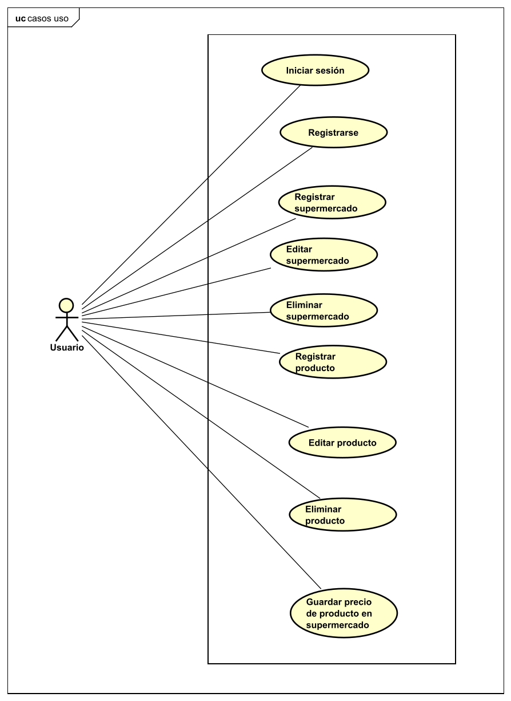
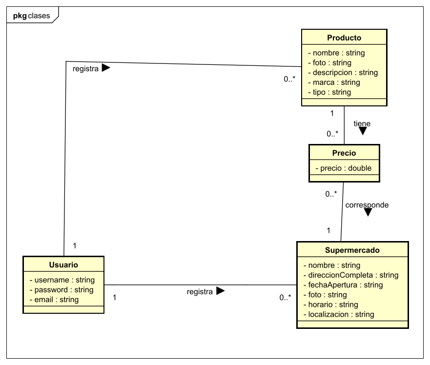
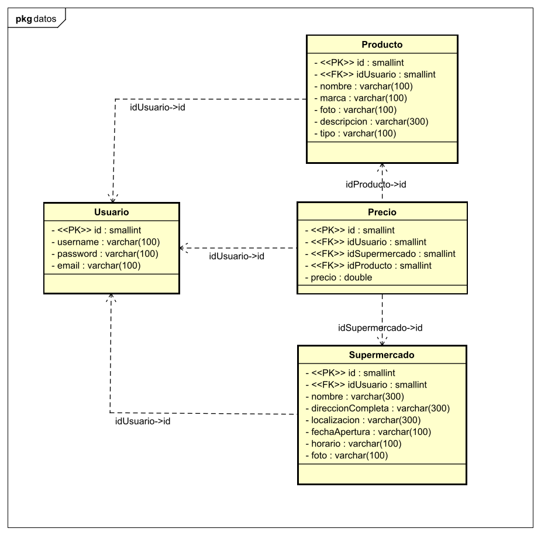
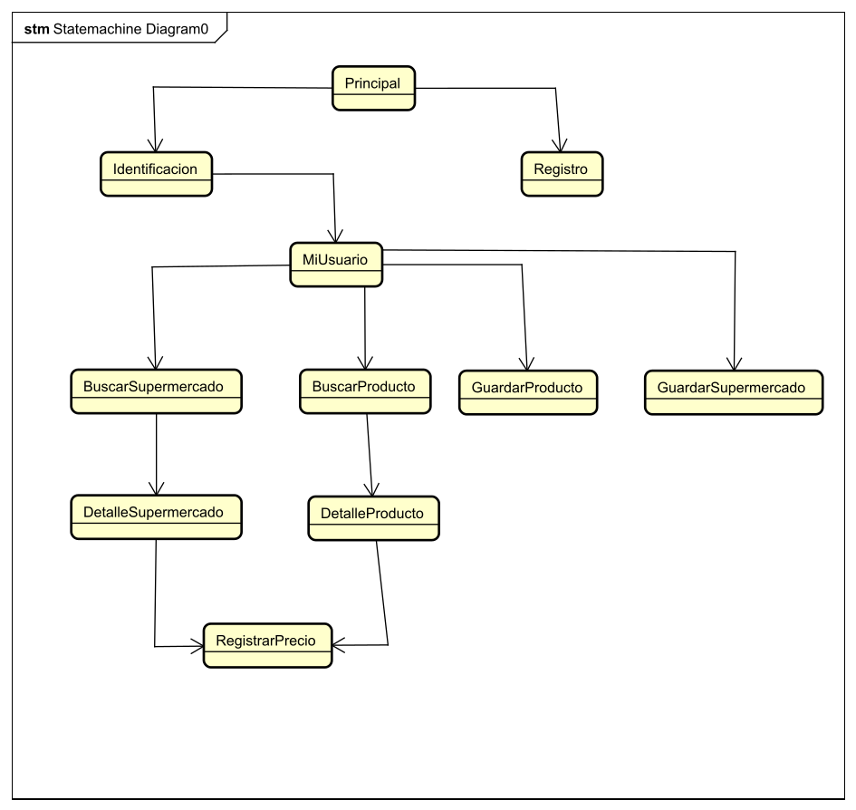
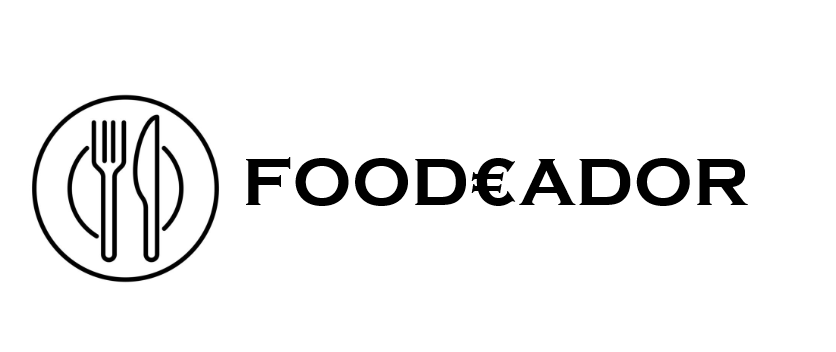
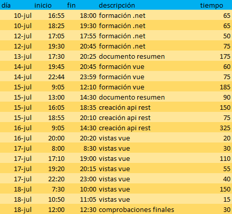

<h1>Documento resumen del proyecto para crear la aplicación "Foodeador"</h1>

<ol>
<h2><li>Resumen del proyecto</li></h2>

Esta aplicación permitirá registrar supermercados y productos, y a partir de ellos, registrar precios de los productos en los supermercados. Los usuarios podrán registrar un producto o un supermercado y editarlo o eliminarlo, y con estos productos y supermercados, los usuarios pueden registrar precios de los productos en los supermercados. De los productos se recogerán atributos como el nombre, la descripción o la marca y de los supermercados se recogerán el nombre, la localización o el horario.

<h2><li>Aplicaciones similares</li></h2>

Se han encontrado diferentes páginas para comparar los precios de los alimentos que se pueden utilizar como referencia:

<ol>
  <li>https://ahorramercado.com/comparador</li>
  <li>https://www.missupermercados.com/</li>

</ol>

<h2><li>Tecnologías utilizadas</li></h2>

Se van a utilizar las siguientes tecnologías:

<ul>
<li>Frontend: Vue y SCSS</li>
<li>Backend: .net</li>
<li>Base de datos: MySQL</li>
</ul>

<h2><li>Funcionalidad de la aplicación. Casos de uso</li></h2>

A continuación se expone el diagrama de casos de uso de la aplicación:

<h2><li>Diagrama de clases</li></h2>

A continuacion se expone el diagrama de clases de la aplicación:

<h2><li>Estructura de la base de datos</li></h2>

A continuación se muestra la estructura de la base de datos relacional con las tablas, las claves primarias y las claves foráneas.

<h2><li>Estructura del backend</li></h2>

En el backend se ha construido una API REST con .net que contiene diferentes rutas a las que el frontend puede realizar peticiones. Cada ruta, llama una función de un archivo que contiene todas las acciones que se pueden realizar en la base de datos. Cada función realiza la operación definida con una sentencia MySQL y a continuación devuelve la respuesta al frontend.

<h2><li>Estructura del frontend</li></h2>
La aplicación contará con las siguientes vistas:
<ul>
<li>PantallaPrincipal: esta vista funcionará como una landing page.</li>
<li>Identificación: esta vista contará con un formulario para que el usuario se identifique.</li>
<li>Registro: esta vista contará con un formulario para que el usuario se registre. </li>
<li>MiUsuario: esta vista aparecerá al identificarse y contendrá los productos, supermercados y precios que haya registrado el usuario.</li>
<li>BuscarSupermercado: en esta vista el usuario podrá buscar supermercados por su nombre.</li>
<li>BuscarProducto: en esta vista el usuario podrá buscar productos por su nombre.</li>
<li>DetalleSupermercado: en esta vista se mostrarán todos los detalles de un supermercado.</li>
<li>DetalleProducto: en esta vista se mostrarán todos los detalles de un producto.</li>
<li>RegistrarPrecio: en esta vista el usuario podrá guardar un precio de un producto en un supermercado.</li>
<li>GuardarProducto: esta vista contendrá un formulario donde el usuario puede guardar un producto rellenando los campos. Además, si quiere editar un producto que haya creado él, se cargarán los datos del producto a editar.</li>
<li>GuardarSupermercado: esta vista contendrá un formulario donde el usuario puede guardar un supermercado rellenando los campos. Además, si quiere editar un supermercado que haya creado él, se cargarán los datos del supermercado a editar.</li>

</ul>

La navegación entre las diferentes vistas en la siguiente:

<h2><li>Bocetos del frontend</li></h2>
Se han realizado bocetos con Figma con la idea básica de como será la aplicación. Estos bocetos han servido de guía para el desarrollo de la aplicación, sin embargo durante el desarrollo se han encontrado mejoras sobre estos bocetos. Por lo tanto el resultado final, combina los bocetos con ideas aparecidas durante el desarrollo. Los bocetos se encuentran en el pdf adjunto bocetos-foodeador.

<h2><li>Detalles de la aplicacion</li></h2>
<ul>

<li>Colores:
<ul>
<li>Verde claro:#59CB34</li>
<li>Verde oscuro:#278707</li>
</ul>
</li>
<li>Icono:</li>

</ul>
<h2><li>Registro del tiempo</li></h2>

A continuación se detalla el tiempo utilizado para el proyecto: 

<strong>Tiempo empleado: 1840 minutos (30 horas y 40 minutos)</strong>

<h2><li>Resultado final: vídeo youtube y repositorio</li></h2>
Repositorio Github: https://github.com/chemiya/PR-23-Foodeador

Video Youtube: https://www.youtube.com/watch?v=8yJiPx5QUOA

<h2><li>Conclusiones</li></h2>
He aprendido como crear una API REST con .net y como gestionar con ella los datos de una base de datos MySQL. He seguido aplicando y ampliando los conocimientos que tenía sobre Vue y SCSS.

</ol>
